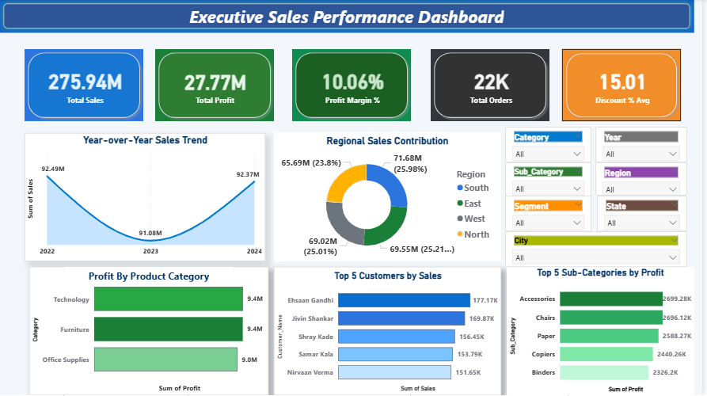
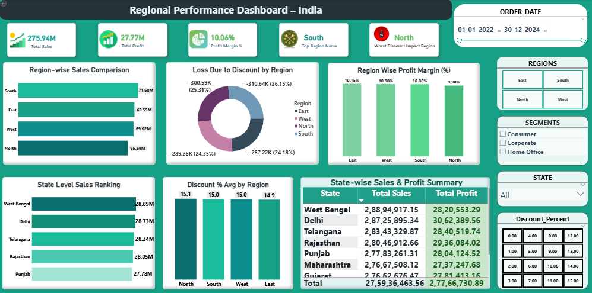
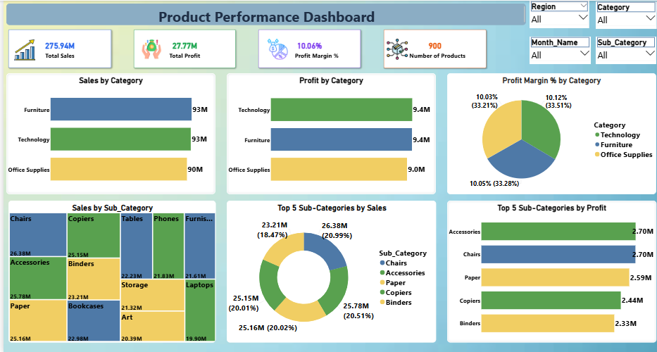
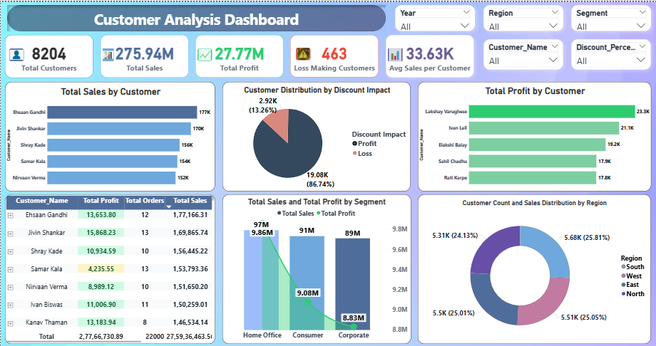
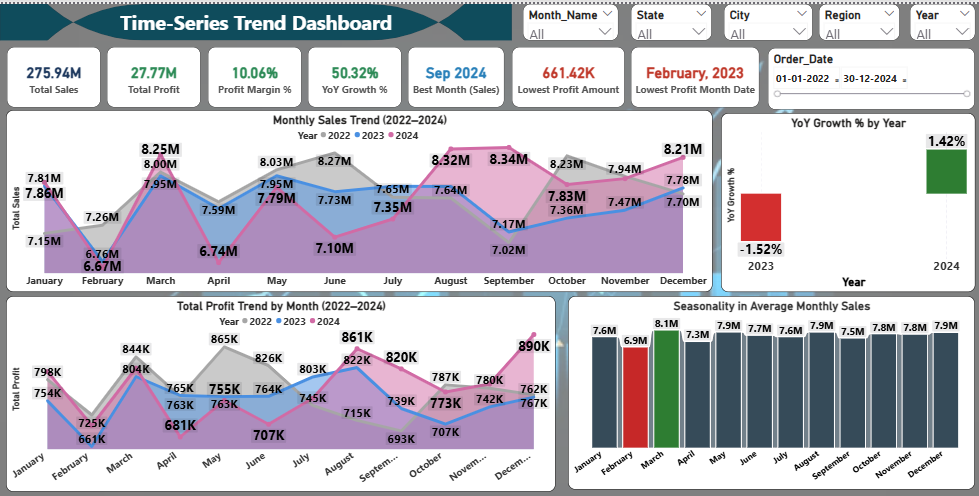

# 📊 GlobalMart India – Power BI Business Analytics Dashboard

## 🏢 Company Background
GlobalMart India Pvt. Ltd. is a retail and e-commerce company operating across India in both **B2C and B2B** segments.  

The company deals in the following product categories:
- Furniture  
- Technology  
- Office Supplies  

The sales dataset spans from **2022 to 2024**, covering multiple **regions, states, product categories, sub-categories, and customer segments** across India.

## 📌 Project Scope
- **Geography:** India  
- **Time Period:** 2022 – 2024  
- **Business Type:** Retail & E-commerce (B2C + B2B)   
- **Data Sources:** Excel / CSV  

## 🎯 Business Problem

Despite having large volumes of sales data, management lacked a **centralized and interactive analytics dashboard** to answer key business questions such as:
- How are sales and profits performing across regions and states?  
- What is the impact of discounts on overall profitability?  
- Which products and customers are truly driving profit?  
- How are sales and profit trending over time?  

Due to the absence of a single source of truth, decisions related to **pricing, promotions, and regional expansion** were largely **assumption-based**.

## 💡 Project Objective
To design and develop an **interactive Power BI dashboard** that enables management to:
- Track overall sales and profit performance  
- Compare regional and state-wise performance  
- Analyze product category and sub-category profitability  
- Evaluate customer segment contribution  
- Understand the relationship between discounts and profit  
- Identify top-performing and loss-making customers  
- Monitor trends, seasonality, and year-over-year growth  

## 📊 Key Performance Indicators (KPIs)
- Total Sales  
- Total Profit  
- Profit Margin (%)  
- Total Orders  
- Average Discount (%)  
- Year-over-Year (YoY) Growth (%)  
- Best Month by Sales  
- Worst Month by Profit  
- Loss Due to Discount  
- Average Sales per Customer  
- Total Customers  
- Loss-Making Customers  

## 📸 Dashboard Preview

### 🔹 Overview Dashboard


### 🔹 Regional Performance Analysis


### 🔹 Product Category Analysis


### 🔹 Customer Analysis


### 🔹 Time Series Trend



## 🧠 Insights Generated

- The business generated **₹275.94M in total sales** with an overall **profit margin of 10.06%**, indicating moderate profitability with a strong dependence on discount strategies.

- Sales declined in **2023** but recovered significantly in **2024**, highlighting the effectiveness of corrective pricing and promotional actions.

- The **South region** is the top-performing region by sales, while the **North region** shows the highest profit leakage due to aggressive discounting.

- High discounts do **not consistently translate into higher profit**. Regions and customers with controlled discounting maintain healthier profit margins.

- **Technology and Furniture** categories contribute the highest profit, while **Office Supplies** generates comparatively lower margins despite stable sales.

- A small group of customers contributes a disproportionately high share of total profit, emphasizing the importance of **customer retention and targeted pricing strategies**.

- Approximately **13% of customers are loss-making**, primarily due to excessive discounts, indicating opportunities for customer-level profitability optimization.

- **Chairs and Accessories** are the most profitable sub-categories, suggesting a shift from volume-based selling to profit-focused product strategies.

- Sales show strong seasonality, with peak performance during **August–September** and consistent dips in **February**.

- Profit trends do not always move in line with sales trends, reinforcing the need to balance revenue growth with discount and cost control.

## 🛠 Tools & Technologies Used
- Power BI Desktop  
- Power Query  
- DAX  
- Excel / CSV  
- Data Modeling (Star Schema)  

## 📁 Repository Structure

```
Globalmart-India-Powerbi-Dashboard/
│
├── Dataset/
│   └── GlobalMart_Sales_Data.csv
│
├── Docs/
│   ├── 01_Overview_Dashboard.png
│   ├── 02_Regional_Sales_Analysis.png
│   ├── 03_Product_Category_Analysis.png
│   ├── 04_Customer_Analysis.png
│   └── 05_Time_Series_Trend.png
│
├── LICENSE
└── README.md
```

## ✅ Conclusion
This Power BI project transforms raw sales data into actionable insights, enabling management to shift from intuition-driven decisions to data-driven strategies across sales, profitability, customers, and regions.

## 📂 Files Included
- Power BI Dashboard (.pbix)
- Cleaned Dataset (CSV)
- Dashboard Screenshots


